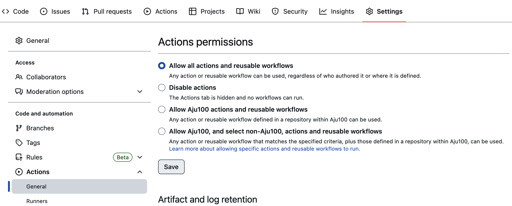
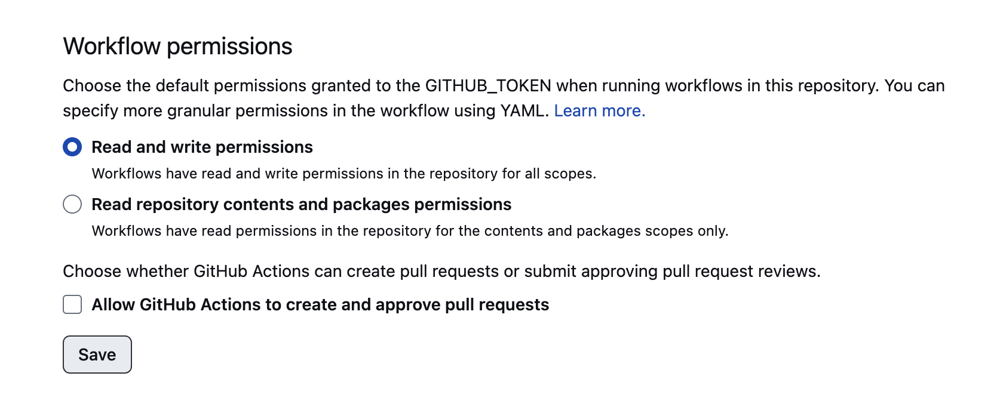
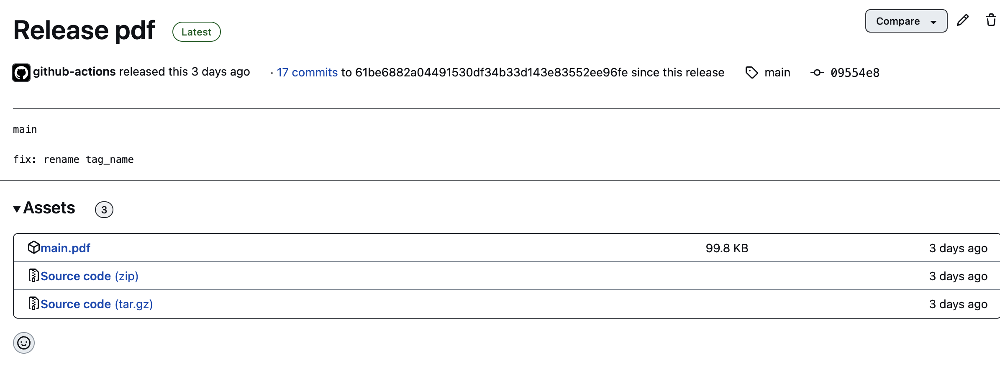

# Resume

This resume template is designed for self-taught tech people and utilizes the base LaTeX templates and fonts, making it easy to install and update. The template includes well-documented sections, ensuring easy customization.

You can export the PDF using Github Action by forking the repo. The layout features a single-page, one-column design to provide a clear and concise representation of your skills and experience. 

## Preview

## Usage
- Latex Editor
    - Offline
        - [Texmaker](https://www.xm1math.net/texmaker/index.html)
        - [Texstudio](https://www.texstudio.org/)
    - Online
        - [Overleaf](https://www.overleaf.com/)
        - [Papeeria](https://www.papeeria.com)
- Visual Studio Extension
    - [Latex Workshop](https://marketplace.visualstudio.com/items?itemName=James-Yu.latex-workshop)
- Github Action
    - Fork this project.
    - git clone https://github.com/yourusername/resume.git
    - Configure Github Action on your fork project settings.
        - Go to settings 
        
        - Enable Permission to read and write.
        
    - Make changes on main.tex to generate and export your resume pdf.
    - Actions will get triggered and exported in the release.
        
    - Click on the release and download your updated main.pdf file.
        

## License
MIT Licensed. See [LICENSE](LICENSE) for full details.